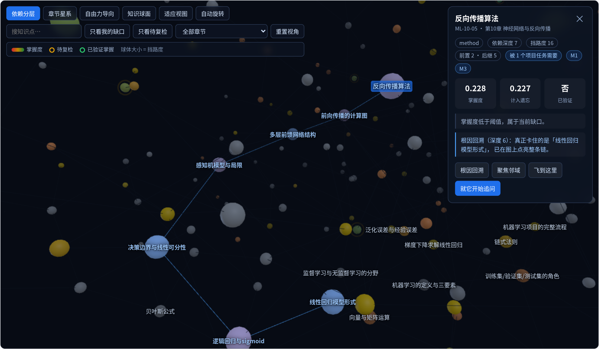
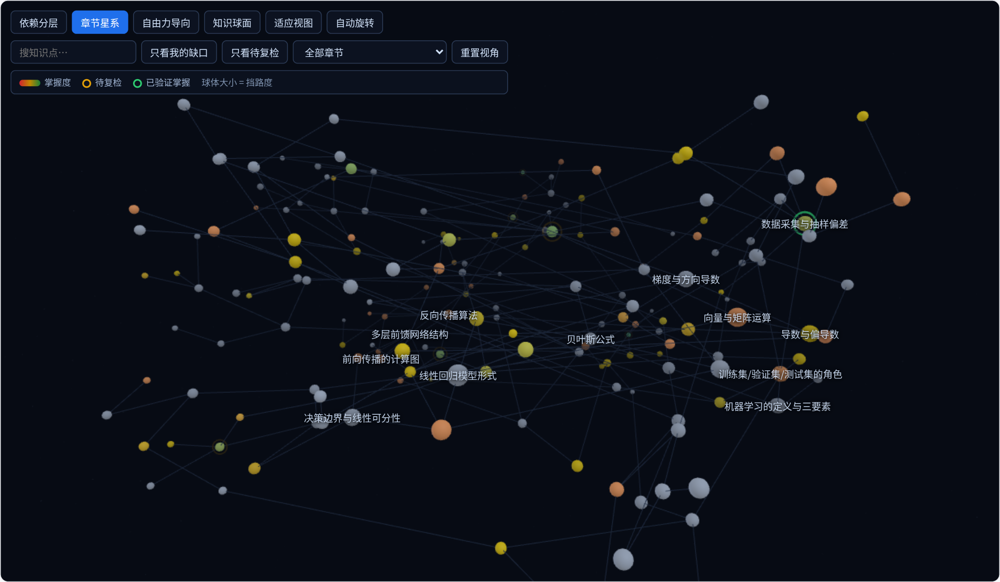

# 院长实验班 AI 教学系统

福建理工大学 人工智能与交通工程学院 · 院长工作室实验班

> 把学生的真实学习状态沉淀为结构化数据，把教师的判错经验积累为可复用资产，
> **让大模型只负责表达**。

服务对象：实验班约 60 名学生、10 名导师、5–10 个真实产业项目。
核心范式：**知识由项目需求拉取，不由课程顺序推送。**

---

## 三十秒跑起来

零外部依赖（Python 3.11+ 标准库即可，`pyyaml` 可选），无需数据库服务、无需 Node：

```bash
git clone https://github.com/codesoldier99/AI_EDU.git && cd AI_EDU
make setup          # 迁移 + 导入知识图谱/项目/知识库 + 生成 60 人虚拟班级
make dev            # 启动 → http://127.0.0.1:8900/
```

没有 `make` 也一样（两者完全等价，后文命令均可如此替换）：

```bash
python3 aiedu.py setup
python3 aiedu.py dev
```

页面右上角切换身份：

| 身份 | 令牌 | 能看到 |
|---|---|---|
| 张导师（实验班A） | `teacher:T001` | 本班诊断、错误模式库、审查队列、简报、学分映射 |
| 王主任（全部班级） | `teacher:T003` | 同上，不限班级 |
| 学生 | `student:2026001` | 只有自己的状态、缺口、追问、副驾驶、成长曲线 |

跨班访问会被 API 拒绝（`tests/test_api.py` 固化了这条边界）。

**没有 API Key 也能完整演示**：模型网关会自动降级为离线确定性表达器。
换句话说——把"嘴"换掉，系统的判断一个字都不会变，只是话说得没那么漂亮。
这正是本项目最重要的架构主张的现场证明。

配置真实模型（可选，OpenAI 兼容接口，Qwen / DeepSeek / vLLM / Ollama 均可）：

```bash
export LLM_BASE_URL=https://dashscope.aliyuncs.com/compatible-mode/v1
export LLM_API_KEY=sk-xxx
export LLM_MODEL=qwen2.5-72b-instruct
make dev            # 业务代码一行不改
```

没有 Key 也想看"接上模型"的效果（评审现场用），起一个本机假底座：

```bash
python3 aiedu.py mock-llm --port 8910     # 另开一个终端
LLM_BASE_URL=http://127.0.0.1:8910/v1 LLM_API_KEY=demo LLM_MODEL=mock-qwen \
python3 aiedu.py dev
```

接上之后**班级诊断的结论、缺口计算、置信度逐字节不变，只有措辞变了**——
这条已经写成自动化测试（`tests/test_llm_switch.py`），每次提交都跑。

---

## 它解决什么

任何教学活动本质上是一个闭环：知道学生现在会什么 → 决定接下来教什么 → 学生做 →
再看他会了什么。传统课堂在三处必然断裂：

| 断裂 | 表现 | 本系统的接法 |
|---|---|---|
| **看不见** | 作业批完是三天后，考试出分是一个月后 | 模块一 个性化诊断：课后当天出全班热力图与**根因** |
| **动不了** | 知道三分之一的人卡住，也只能按统一进度讲 | 模块二/三 引导追问 + 拉取式任务：过程个体化 |
| **接不上** | 项目做得好不好，与知识点掌握判断是两套系统 | 模块四 代码审查：把工程问题翻回知识判断 |

---

## 唯一真正重要的技术判断

**状态与表达必须分离。大模型是嘴，不是脑。**

```
┌─────────────────────────────────────────────┐
│ L3 生成层（可替换）                          │
│ 诊断 / 追问 / 任务 / 审查 / 画像 / 副驾驶     │
└──────────────┬──────────────────────────────┘
               │ 只读状态，写事件
┌──────────────▼──────────────────────────────┐
│ L2 学生状态层（可积累·核心资产）             │
│ BKT 掌握度 · 能力画像 · 事件流 · 错误模式库   │
│ ┌─ engagement（派生态，只读事件流，不回写）  │
└──────────────┬──────────────────────────────┘
               │ 只读图谱
┌──────────────▼──────────────────────────────┐
│ L1 知识与能力图谱层（可积累）                 │
│ 知识点 · 依赖 DAG · 能力模块 · 任务-知识点映射 │
└─────────────────────────────────────────────┘
```

把状态交给大模型推断，会同时失去可信、可查、可积累三样东西。
最致命的是第三样：状态若不沉淀为结构化数据，换一届学生、换一个模型，系统就重新开始。

**铁律：任何可积累的东西，都不得依赖任何可替换的东西的内部实现。**

这些约束不是写在文档里靠自觉，而是被测试与数据库约束固化下来：

```bash
make check          # 架构铁律静态检查（依赖方向、越权写状态、SDK 直连…）
make replay         # 从事件流重算全班状态，逐条比对
```

| 铁律 | 固化方式 |
|---|---|
| L3 不得直接写 L2 | `tests/test_layering.py` AST 检查 + DB 触发器 |
| 事件流只追加 | `migrations/002_append_only.sql` 触发器，UPDATE/DELETE 即 ABORT |
| 掌握度必须挂事件 | `mastery_state.last_event_id` 非空触发器 |
| engagement 不得写 state | AST 标识符检查 |
| 禁止直连大模型 SDK | AST 导入检查 |
| 不生成教师评价数据 | schema 关键字检查 |
| 只奖励坚持，不奖励正确率 | `ALLOWED_KINDS` 白名单 + 运行时 `ValueError` |
| 换模型不改变任何判断 | `tests/test_llm_switch.py` 走真实 HTTP，逐字节比对结论 |

---

## 拉取式：本项目与传统智能教学系统的分野

传统做法按知识点依赖顺序排课，学生"先学半年螺丝刀再拆引擎"。本系统反过来：

```
学生接到项目任务
  → 系统识别该任务所需知识点（TaskKPLink，导师标注）
  → 计算缺口 = 所需 − 已掌握
  → 只推送此刻最挡路的 1–2 个
  → 学完立刻用回项目
```

知识图谱的角色因此改变：依赖边不再是"教学顺序表"，而是"按需检索索引"——
它回答的是"要做这个，还缺什么"。拓扑序仍保留，但**只用于计算缺口内部的先后**。

```bash
make gap STUDENT=1 TASK=T-AGV-3
```

```
学生：钱艳（2026001）
任务：T-AGV-3 障碍物识别模型
掌握度阈值：0.75    所需知识点 3 个，已掌握 0 个
------------------------------------------------------------------------------
知识点                                    掌握度     挡路度    拓扑  前置卡点
反向传播算法                               0.214    14.0     0  -
卷积操作与局部感受野                           0.000     2.5     1  -
池化与平移不变性                             0.000     2.0     2  151
------------------------------------------------------------------------------
本次只推 2 个（拉取式：一次只给最挡路的 1–2 个）
```

---

## 五个模块是一条链，不是五个并列的工具

```
诊断 → 引导 → 任务 → 审查 → 画像 →（回到诊断）
```

| 模块 | 在链条中的作用 | 关键实现 |
|---|---|---|
| ① 个性化诊断 | 定位学生此刻在哪，尤其是回溯出真正的病根 | `graph/algo.trace_root_cause` 沿依赖边反向 BFS |
| ② 苏格拉底追问 | 从他已会的最近一点切入，让他自己走过去 | `agents/asking.AskingStrategy` 决定起点/深度/类型 |
| ③ 拉取式任务 | 把知识放进真实任务 | `agents/task.compute_gap` + 挡路度排序 |
| ④ 代码与文档审查 | 从产出反查理解 | 静态分析 + 模型评审，`related_kp_ids` 回写 L2 |
| ⑤ 学习成效画像 | 把单次循环拉长为成长轨迹 | 能力雷达 / 成长曲线 / 知识覆盖图 |
| ⑥ 学习副驾驶 | 全天候陪练 | 项目库 RAG + 个人能力档案 + 主动同步 |
| ⑦ 掌握的质量 | 陪到真的会，并且能证明 | 跨时间验证 / 遗忘复检 / 提示依赖度（`state/verification.py`）|

**审查是把实践信号翻回知识判断的唯一通道**，缺了它项目与课程仍是两张皮。
原则是宁缺毋滥：只有 `data/seed/rule_kp_map.yaml` 中标注 `reliable: true` 的规则、
且经教师采纳后，才会以 0.5 的证据权重回写 L2。

---

## 掌握的质量：一次做对不算掌握

达标只是"暂定掌握"。系统还要回答三个更难的问题：

| 问题 | 不问的后果 | 答法 |
|---|---|---|
| **验证了吗** | 当堂练到做对就记为掌握，下周全忘 | 两次做对间隔 ≥ 7 天才算**已验证掌握** |
| **还在吗** | 学期初的达标一直挂着，无人回访 | 按半衰期衰减，掉到复检线以下进「该复习了」 |
| **是自己挣来的吗** | 把认知外包出来的正确率当成学习成效 | 区分提示前/提示后做对，输出无提示做对率 |

演示数据实测：全班 67 个达标点里**只有 24 个经得起隔周再考**（验证率 36%），
另有 50 个已掉到复检线以下——这个数字本身就是对"达标即掌握"的一次证伪。

关键约束：**衰减只算不写**。把遗忘写回 `mastery_state`，掌握度就不再等于事件流
折叠的结果，`make replay` 立刻失去意义。所以它们全是派生视图，一张新表都没建。

提示依赖度是**诊断指标，禁止作为优化目标、激励对象或排名依据**——
指标一旦被当成目标就会被优化，然后失去意义。

背景与取舍见 [`docs/learnvector-研判.md`](docs/learnvector-研判.md)。

---

## 知识宇宙：3D 知识图谱



*点一个薄弱点按【根因回溯】，系统沿依赖边把整条链点亮并把镜头框到这条链上——
图中蓝色那条就是「反向传播算法 ← … ← 线性回归模型形式」，
与班级诊断报告走同一个算法、同一份图谱结构。*

`apps/web/graph3d.js`，three.js 本地 vendor，**不走 CDN，断网可用**。

- **四种布局**：依赖分层（Y = 依赖深度，前置在下）/ 章节星系（层次聚类）/
  自由力导向 / 知识球面，切换有动画过渡
- **视觉编码**：颜色 = 掌握度（与 2D 热力图同一套色阶）、球体大小 = 挡路度、
  琥珀色脉冲光环 = 待复检、青绿描边 = 已验证掌握、灰色 = 无作答记录
- **根因链点亮**：选一个薄弱点点【根因回溯】，系统沿依赖边把整条链亮起来并飞过去——
  "他不是反向传播不会，是链式法则没通"这句话，在这里是看得见的一条光路
- **交互**：轨道旋转/缩放/平移、悬停高亮、单击聚焦邻域、双击飞行、搜索、
  章节过滤、只看缺口、只看待复检
- **性能**：节点 InstancedMesh、边单个 LineSegments，两个 draw call；
  标签用 HTML 覆盖层（中文清晰）并做降噪，同一时刻最多 14 个；
  500 节点单步 3.2ms，远低于一帧预算



*章节星系布局。琥珀色光环 = 该复习了，青绿描边 = 已验证掌握。*

渲染壳无法单测，但布局物理、色阶、降噪策略抽在 `apps/web/kg-core.js`，
17 个用例覆盖（含"依赖深度与 Y 坐标相关系数 > 0.9"这类断言）。

**深链**：`http://127.0.0.1:8900/?token=teacher:T001&tab=universe&student=7`
——演示时直接发链接，省掉"先切身份再点标签"的口头指挥。

---

## 学习工作台：切目标，不切引擎

一个标签页，四个能力，共用同一份学生状态。形取自 DeepTutor（港大 HKUDS，
Apache-2.0，约 3.6 万星）的 agent-native 设计；判定权一分没让——
逐条取舍见 [`docs/deeptutor-研判.md`](docs/deeptutor-研判.md)。

| 能力 | 它怎么做 | 我们怎么做 |
|---|---|---|
| **出题测练** | 模型出题、模型批改 | 练什么由复检 / 待验证 / 任务缺口 / 根因四类**算出来**；模型只写题面且必须挂教材依据；模型出的题一律进**待审队列**，教师确认才发给学生；判分走确定性规则 |
| **分步解题** | 把完整推理讲清楚 | **一次只交出一步**。学生先答，判定走确定性工具（数值走求值器，文字走关键词覆盖），答不上来才逐级降级，降到 L3 才给该步结论并标记教师介入 |
| **限域调研** | 接六家网络搜索 | 只查院内三个知识库；生成后**再量一次落地性**（n-gram 重合率），低支撑段落标出来不删；产出计入交付物，**不计入掌握度** |
| **图示** | 模型写 Chart.js / Mermaid | SVG 由确定性纯函数生成，模型只写图下面那句解读。零图表库、零 CDN |

由此确立了第 7 条架构铁律：**判不了 ≠ 判错**。

关键词覆盖率落在 0.2–0.7 之间、数值作答里出现多个数字、选项解析不出来——
这些一律不判，写行为事件但不更新掌握度，进教师人工队列。
理由很实际：BKT 的证据流是这套系统最贵的东西，掺进去一条"其实没判出来但记成错了"
的证据，后面所有诊断都会跟着歪，而且**歪得看不出来**。

同理，证据权重随判定的确定性走：教师判分 1.0 > 选择/数值规则 1.0 >
数值校验 0.7 > 文本规则 0.5。

```bash
make practice STUDENT=3     # 打印"此刻该练什么"及每一条的理由
```

```
知识点                    来源      掌握度   挡路度  优先级  理由
机器学习的定义与三要素      根因点     0.000   40.0    6.80  「机器学习不适用的场景判别」的上游薄弱点，先补这里更省力
机器学习项目的完整流程      任务缺口   0.514   13.5    3.35  任务「需求分析与技术选型」需要它，掌握度 0.51 < 0.75
题库缺口（该练但没题，教师优先在这些点上出题）：
  ✗ 机器学习的定义与三要素（根因点）
```

最后那两行是这套设计的副产品，也是最有用的一个输出：
它直接告诉教师**下一批题该出在哪**，比任何"命中率"都实在。

### 教学技能包：教师写 Markdown 就能扩展

`skills/` 下放一个带 frontmatter 的 `.md`，存盘即生效，不改代码、不重启：

```markdown
---
name: counterexample-first
kind: asking_style
style: 反例质疑
---
不要问"你理解这个概念了吗"，问"什么情况下它不成立"。
给出的反例要具体到能算……
```

格式沿用 DeepTutor 的开放 Agent-Skills 约定，但用途收窄了一格：
**技能包只能影响"怎么问、怎么出题"，够不到"算不算掌握"**。
也不做远程 hub 安装——技能包进 git，教师可读、可评审、可回滚。
`make skills` 查看已装载的包及其文件指纹。

---

## 关于"不做什么"

- ❌ 不让大模型判断"学生是否掌握某知识点"——必须由 BKT 依据事件产生
- ❌ 不以当场正确率、做题数、停留时长作为任何优化目标或激励对象
- ❌ 不为提升体验而降低任务难度或提前给答案
- ❌ 不向学生展示"课程进度百分比"（只有知识点掌握度）
- ❌ 不做全班排行榜（避免挫伤后进者），只做个人成长曲线
- ❌ 不生成任何针对**教师**的评价性数据
- ❌ 不把提示依赖度做成排名或考核
- ❌ 不把一次做对当成掌握并从此不再回访
- ❌ 前端不引用任何 CDN 资源（演示环境常常没有外网）

已有证据表明：不加限制的 AI 辅助会使学生独立考试成绩下降约 17%，引导式提示则显著更优。
若系统以"提高当场答对率"为目标，会训练出让学生越学越弱的系统。
**评测指标的选择本身就是架构决策。**

追问降级机制（关键提示 → 解题框架 → 完整解析 + 标记教师介入）是为了防止挫败感摧毁动机，
**不是为了让学生轻松**；每一次降级都写入事件流，并出现在教师的降级热点里。

---

## 工程约束与技术栈

| 层 | 当前实现 | 生产形态 |
|---|---|---|
| 后端 | 标准库 HTTP（FastAPI 风格路由） | FastAPI |
| 数据库 | SQLite（SQL 写成双兼容子集） | PostgreSQL 16 + pgvector |
| 向量 | 哈希字符 bigram 确定性嵌入 | 真实 embedding，换模型批量重算 |
| 大模型 | 离线表达器 / OpenAI 兼容接口 | Qwen / DeepSeek 私有化部署 |
| 前端 | 原生 JS + CSS，零构建 | React + TypeScript + Tailwind |
| 测试 | unittest（99 个用例，含 17 个前端逻辑用例） | pytest |

之所以先做成零依赖版：**演示环境与生产环境跑的必须是同一套逻辑**。
所有可替换件都在接口后面（`packages/llm`、`packages/rag`、`packages/core/db`），
替换时业务代码不动——`tests/test_rag_llm.py` 用一个假模型客户端证明了这一点。

不用 Neo4j 的理由：单课程 300–500 知识点，递归查询足够，省一套运维；
接口已在 `packages/graph` 隔离，将来成瓶颈再迁。

---

## 目录

```
apps/api            仅路由与鉴权，无业务逻辑
apps/web            前端（零构建）
packages/graph      L1 知识图谱：知识点、依赖边、能力模块、任务-知识点映射
packages/state      L2 学生状态：BKT、掌握度、事件流、重算校验
packages/engagement 参与度派生态（只读事件流）
packages/errors     错误模式库（最有价值的资产）
packages/quiz       题库 + 确定性选题 + 确定性判分（不依赖大模型）
packages/tools      确定性工具箱：安全算术求值、落地性检查（零依赖叶子）
packages/skills     教学技能包装载（SKILL.md）
packages/rag        三个知识库 + 图谱结构化过滤的混合召回
packages/llm        大模型统一封装（可替换层）
packages/agents     L3 智能体 + 知识宇宙视图投影
packages/adapters   项目数据适配器（每项目一个）
migrations          数据库迁移与约束
data/seed           课程图谱 / 项目任务 / 知识库 / 规则映射（教师可直接维护）
skills              教学技能包（教师可写，进 git，不从网上装）
scripts             seed / demo / replay / gap / practice / skills / lint / mock_llm / make_deck
tests               177 个用例，含架构铁律、换模型不变性、判分边界、前端布局物理
docs                架构说明、标注规范、API、演示脚本
```

## 常用命令

```bash
make setup                          # 一键就绪
make dev                            # 启动（默认 :8900）
make test                           # 全量测试
make test-state                     # 仅测状态层（改 BKT 后必跑）
make check                          # 架构铁律自检
make replay STUDENT=1               # 从事件流重算，校验一致性
make gap STUDENT=1 TASK=T-AGV-3     # 打印任务知识缺口
make practice STUDENT=1             # 打印此刻该练什么及其理由
make skills                         # 列出已装载的教学技能包
make test-study                     # 仅测学习工作台
make lint                           # 静态检查
make reset                          # 清空数据库

python3 aiedu.py <同名子命令>        # 无 make 环境的等价入口
```

## 文档

- [`docs/architecture.md`](docs/architecture.md) —— 架构决策与依据
- [`docs/kp-annotation.md`](docs/kp-annotation.md) —— 知识点标注规范（教师用）
- [`docs/api.md`](docs/api.md) —— 接口清单
- [`docs/demo.md`](docs/demo.md) —— **汇报与演示预案**（会前检查单、四段演示逐步照做、Q&A 预案）
- [`docs/slides/`](docs/slides/) —— 汇报 PPT（12 页，pptx + pdf），由 `scripts/make_deck.py` 生成
- [`docs/decisions.md`](docs/decisions.md) —— 待教师团队拍板的参数
- [`docs/learnvector-研判.md`](docs/learnvector-研判.md) —— LearnVector 研判：吸收什么、不跟什么
- [`docs/deeptutor-研判.md`](docs/deeptutor-研判.md) —— DeepTutor 研判：抄能力，不抄判断权
- [`CLAUDE.md`](CLAUDE.md) —— 架构铁律与开发规范（每次开工必读）
- [`DEVELOPMENT_PLAN.md`](DEVELOPMENT_PLAN.md) —— 分阶段开发计划与验收标准

---

人工智能与交通工程学院 · 2026
